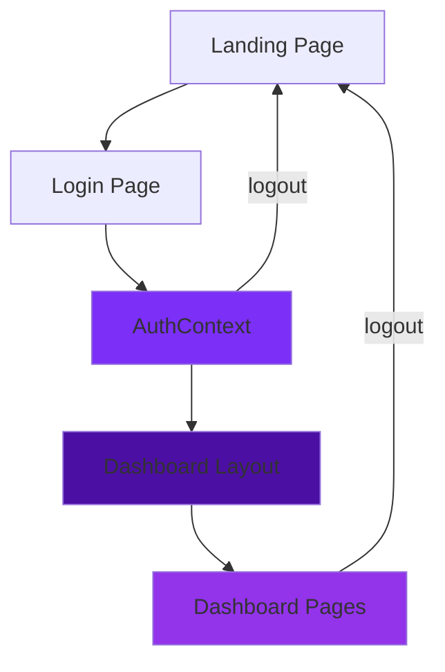
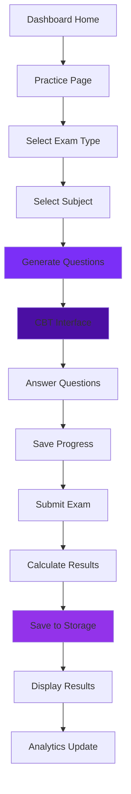
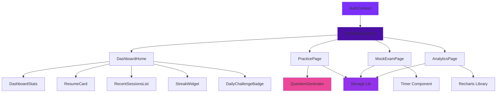
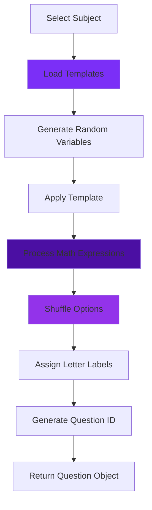
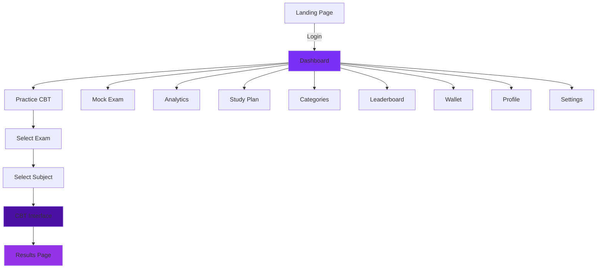
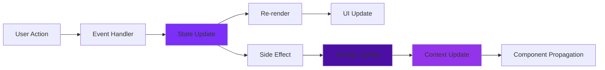

# Preplyx CBT Platform - Architecture Diagram

## 📁 Project Structure Overview

```
CBT (Monorepo Root)
├── 📁 preplyx/ (Next.js Application - Main Platform)
│   ├── 📁 src/
│   │   ├── 📁 app/ (Next.js App Router)
│   │   │   ├── 📁 dashboard/ (Main Application)
│   │   │   │   ├── 📁 layout.tsx (Dashboard Layout with Sidebar)
│   │   │   │   ├── 📁 page.tsx (Dashboard Home)
│   │   │   │   ├── 📁 practice/ (CBT Practice System)
│   │   │   │   │   ├── 📁 page.tsx (Exam/Subject Selection)
│   │   │   │   │   └── 📁 [exam]/[subject]/page.tsx (CBT Interface)
│   │   │   │   ├── 📁 mock-exam/page.tsx (Mock Exam with Timer)
│   │   │   │   ├── 📁 analytics/page.tsx (Performance Analytics)
│   │   │   │   ├── 📁 categories/page.tsx (Exam Categories)
│   │   │   │   ├── 📁 leaderboard/page.tsx (Leaderboard)
│   │   │   │   ├── 📁 study-plan/page.tsx (Study Planning)
│   │   │   │   ├── 📁 review/page.tsx (Question Review)
│   │   │   │   ├── 📁 wallet/page.tsx (Wallet System)
│   │   │   │   ├── 📁 premium/page.tsx (Premium Plans)
│   │   │   │   ├── 📁 achievements/page.tsx (Gamification)
│   │   │   │   ├── 📁 notifications/page.tsx (Notifications)
│   │   │   │   ├── 📁 profile/page.tsx (User Profile)
│   │   │   │   └── 📁 settings/page.tsx (Settings)
│   │   │   ├── 📁 login/page.tsx (Login Page)
│   │   │   ├── 📁 page.tsx (Landing Page)
│   │   │   ├── 📁 layout.tsx (Root Layout)
│   │   │   └── 📁 globals.css (Global Styles)
│   │   ├── 📁 components/ (Reusable Components)
│   │   │   ├── 📁 DashboardStats.tsx (Statistics Display)
│   │   │   ├── 📁 ResumeCard.tsx (Resume Practice Card)
│   │   │   ├── 📁 RecentSessionsList.tsx (Session History)
│   │   │   ├── 📁 StreakWidget.tsx (Study Streak Display)
│   │   │   ├── 📁 DailyChallengeBadge.tsx (Daily Challenges)
│   │   │   └── 📁 QuestionNavigator.tsx (Question Navigation)
│   │   ├── 📁 context/ (State Management)
│   │   │   └── 📁 AuthContext.tsx (Authentication Context)
│   │   └── 📁 lib/ (Utility Libraries)
│   │       ├── 📁 storage.ts (LocalStorage Management)
│   │       └── 📁 questionGenerator.ts (Question Generation Engine)
│   ├── 📁 public/ (Static Assets)
│   └── 📄 package.json (Next.js Dependencies)
│
└── 📁 src/ (Vite + React Application - Landing Page)
    ├── 📁 components/ (Landing Page Components)
    │   ├── 📁 Navbar.tsx (Navigation Bar)
    │   ├── 📁 Hero.tsx (Hero Section)
    │   ├── 📁 Features.tsx (Features Section)
    │   ├── 📁 Subjects.tsx (Subjects Display)
    │   ├── 📁 Statistics.tsx (Statistics Section)
    │   ├── 📁 Testimonials.tsx (Testimonials)
    │   ├── 📁 CTA.tsx (Call to Action)
    │   ├── 📁 FAQ.tsx (FAQ Section)
    │   └── 📁 Footer.tsx (Footer)
    ├── 📁 main.tsx (Application Entry Point)
    ├── 📁 App.tsx (Main App Component)
    └── 📄 package.json (Vite Dependencies)
```

## 🔄 Core System Architecture

### 1. Authentication Flow



### 2. CBT Practice System Flow



### 3. Data Flow Architecture

```mermaid
graph LR
    A[User Actions] --> B[React Components]
    B --> C[State Management]
    C --> D[LocalStorage]
    D --> E[Session Persistence]
    E --> F[Question Generator]
    F --> G[Dynamic Questions]
    G --> H[Result Calculation]
    H --> I[Analytics Engine]
    I --> J[Dashboard Display]
    
    style C fill:#7B2FF7
    style D fill:#4B0FA3
    style F fill:#9333ea
    style I fill:#ec4899
```



## 🏗️ Component Architecture

### Dashboard Layout Structure

```
┌─────────────────────────────────────────────────────────┐
│                    ROOT LAYOUT                            │
│  ┌───────────────────────────────────────────────────┐  │
│  │              AUTH PROVIDER CONTEXT                │  │
│  │  ┌─────────────────────────────────────────────┐  │  │
│  │  │           DASHBOARD LAYOUT                  │  │  │
│  │  │  ┌──────────────┐  ┌─────────────────────┐  │  │  │
│  │  │  │   SIDEBAR    │  │   MAIN CONTENT      │  │  │  │
│  │  │  │              │  │                     │  │  │  │
│  │  │  │ - Navigation │  │ - Top Bar           │  │  │  │
│  │  │  │ - User Info  │  │ - Page Content      │  │  │  │
│  │  │  │ - Logout     │  │ - Dynamic Routes    │  │  │  │
│  │  │  └──────────────┘  └─────────────────────┘  │  │  │
│  │  └─────────────────────────────────────────────┘  │  │
│  └───────────────────────────────────────────────────┘  │
└─────────────────────────────────────────────────────────┘
```

### Key Component Relationships



## 💾 Data Storage Architecture

### LocalStorage Schema

```typescript
// Active Session Storage
interface ActiveSession {
  exam: string;              // "JAMB", "WAEC", "NECO"
  subject: string;           // "Mathematics", "English", etc.
  currentQIndex: number;     // Current question index
  answers: Record<number, string>;  // User answers
  flagged: number[];        // Flagged question indices
  timeLeft: number;          // Remaining time in seconds
  lastAccessed: number;     // Timestamp
  totalQ: number;          // Total questions
}

// Completed Sessions Storage
interface CompletedSession {
  id: string;               // Unique session ID
  exam: string;             // Exam type
  subject: string;          // Subject name
  score: number;            // Correct answers
  total: number;            // Total questions
  pct: number;              // Percentage score
  date: number;             // Completion timestamp
  timeSpentSeconds?: number;
  
  details?: {
    questionId: number;
    questionText: string;
    userAnswer: string;
    correctAnswer: string;
    isCorrect: boolean;
  }[];
}

// Daily Activity Tracking
interface DailyActivity {
  activeDays: string[];     // ISO date strings
  currentStreak: number;    // Consecutive days
  monthlyStreak: number;    // Days in current month
}
```

## 🔧 Question Generation System

### Question Generation Flow



### Question Template System

```typescript
// Template Structure
{
  mathematics: [
    { 
      q: "Solve for x: 2x + {a} = {b}", 
      opts: ["{ans}", "{ans+1}", "{ans-1}", "{ans*2}"], 
      ans: 0 
    },
    // ... more templates
  ],
  english: [
    {
      q: "Identify the figure of speech: 'The wind howled...'",
      opts: ["Personification", "Simile", "Metaphor", "Hyperbole"],
      ans: 0
    },
    // ... more templates
  ]
}
```

## 🎯 Key Features Implementation

### 1. Session Management
- **Auto-save**: Progress saved every 5 seconds
- **Session recovery**: Resume interrupted sessions
- **Time tracking**: Accurate time measurement
- **Answer persistence**: Store user answers locally

### 2. Question System
- **Dynamic generation**: 100 questions per subject
- **Template-based**: Structured question templates
- **Randomized options**: Shuffled answer choices
- **Math processing**: Dynamic mathematical expressions

### 3. Analytics & Progress
- **Performance tracking**: Score calculation and storage
- **Streak system**: Daily activity tracking
- **Statistics aggregation**: Overall performance metrics
- **Session history**: Complete practice record

### 4. User Interface
- **Responsive design**: Mobile-friendly interface
- **Real-time updates**: Live timer and progress
- **Intuitive navigation**: Easy question navigation
- **Visual feedback**: Clear answer selection

## 🔀 Navigation Flow



## 🛠️ Technology Stack

### Next.js Application (preplyx/)
- **Framework**: Next.js 16.2.7 (App Router)
- **UI Library**: React 19.2.4
- **Icons**: Lucide React
- **Charts**: Recharts
- **Styling**: CSS with CSS Variables
- **State Management**: React Context API
- **Storage**: LocalStorage API

### Vite Application (Root)
- **Framework**: React 19.2.6 + Vite 8.0.12
- **Animations**: Framer Motion
- **Styling**: Tailwind CSS 4.3.0
- **Icons**: Lucide React
- **Build Tool**: Vite + TypeScript

## 🎨 Design System

### Color Palette
```css
--gradient-primary: linear-gradient(135deg, #7B2FF7 0%, #4B0FA3 100%);
--color-text-main: #0f172a;
--color-text-muted: #64748b;
--glass-border: rgba(0, 0, 0, 0.08);
--shadow-soft: 0 4px 20px rgba(0, 0, 0, 0.05);
```

### Typography
- **Headings**: Bold, tight tracking
- **Body**: Regular weight, good readability
- **UI Elements**: Small, uppercase with letter spacing

## 📊 Performance Metrics

### Tracked Data Points
- Questions answered per session
- Average accuracy across sessions
- Total study time (seconds)
- Current streak (consecutive days)
- Monthly streak (days in current month)
- Subject-specific performance
- Time-based performance trends

## 🔐 Security Considerations

### Current Implementation
- **Mock Authentication**: Development-only auth system
- **Local Storage**: Client-side data persistence
- **No Backend**: Fully client-side application

### Future Enhancements
- Backend API integration
- Secure authentication (JWT/OAuth)
- Server-side session management
- Data encryption
- User privacy protection

## 🚀 Deployment Architecture

### Current Setup
- **Development**: Local development servers
- **Build Processes**: 
  - Next.js: `next build`
  - Vite: `vite build`
- **Deployment Ready**: Both applications production-ready

### Recommended Deployment
- **Next.js App**: Vercel (optimized for Next.js)
- **Landing Page**: Netlify, Vercel, or any static host
- **Domain Configuration**: Subdomain structure

## 📝 File Organization Patterns

### Code Conventions
- **Components**: PascalCase naming
- **Utilities**: camelCase naming
- **Constants**: UPPER_CASE naming
- **Types**: TypeScript interfaces
- **Styles**: CSS-in-JS or global CSS

### Import Patterns
```typescript
// Absolute imports (Next.js)
import { Component } from '@/components/Component';
import { utility } from '@/lib/utility';

// Relative imports (Vite)
import { Component } from './components/Component';
```

## 🔄 State Management Flow



## 🎯 Core Business Logic

### Exam Scoring Algorithm
```typescript
function calculateScore(
  userAnswers: Record<string, string>,
  questions: Question[]
): { score: number; total: number; percentage: number } {
  let correct = 0;
  questions.forEach(q => {
    if (userAnswers[q.id] === q.correct_answer) {
      correct++;
    }
  });
  return {
    score: correct,
    total: questions.length,
    percentage: Math.round((correct / questions.length) * 100)
  };
}
```

### Streak Calculation
```typescript
function calculateStreak(activeDays: string[]): number {
  const sortedDays = activeDays.sort().reverse();
  let streak = 0;
  const today = new Date().toISOString().split('T')[0];
  
  for (let i = 0; i < sortedDays.length; i++) {
    const current = new Date(sortedDays[i]);
    const prev = i > 0 ? new Date(sortedDays[i-1]) : new Date(today);
    const diffDays = Math.abs(current - prev) / (1000 * 60 * 60 * 24);
    
    if (diffDays <= 1) streak++;
    else break;
  }
  
  return streak;
}
```

## 📱 Responsive Design Strategy

### Breakpoints
- **Mobile**: < 768px
- **Tablet**: 768px - 1024px  
- **Desktop**: > 1024px

### Layout Adaptations
- **Sidebar**: Collapsible on mobile
- **Grid**: Responsive column counts
- **Typography**: Scalable font sizes
- **Touch**: Mobile-friendly interactions

---

## 🎯 Summary

This architecture represents a modern, scalable CBT (Computer-Based Test) platform designed for Nigerian students preparing for JAMB, WAEC, and NECO examinations. The system uses:

- **Next.js 16** for the main application with App Router
- **React 19** for UI components
- **LocalStorage** for data persistence
- **Dynamic question generation** for unlimited practice
- **Real-time progress tracking** and analytics
- **Gamification elements** (streaks, achievements)
- **Responsive design** for all devices

The platform is fully client-side, making it fast and cost-effective to deploy while providing a rich, interactive learning experience.